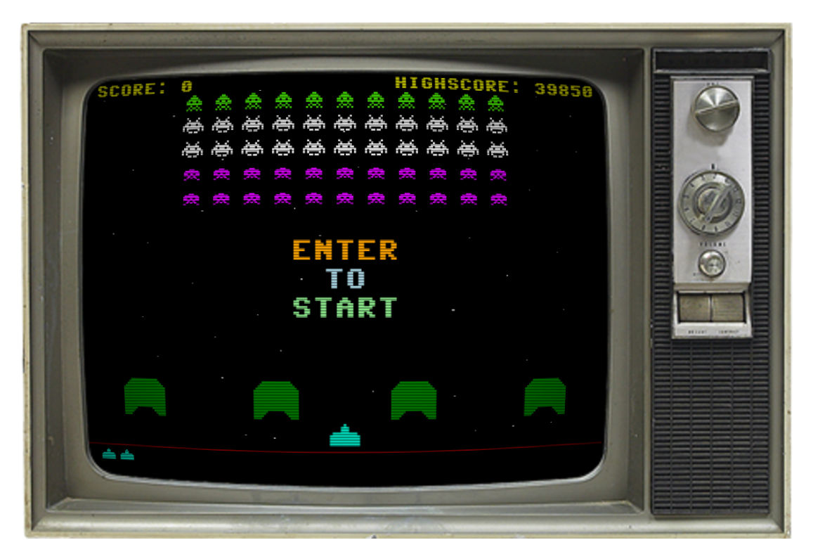

<!-- @format -->

# Space Cowboys

*(YES It comes with an old time TV for you to play on)*
😉

[![Release][release-badge]][release]

I love those old games from my childhood, so I've begone recreating them in JavaScript.

This is my first attempt at recreating **'Space Invaders'** from Taito, most people probably knows it from the Atari 2600 game consol.

[Space Invaders][SI-wiki-link] Wiki page

---

## Thanks and attributions

* [Devin D. Cook][devin-web-link] for the very nice [C64][devin-attr-link] font.
* [Zachary Johnson][zachary-web-link] for the CRT scanline implementation, read the tutorial [here][zachary-attr-link]
* [Evan Wallace][evan-gh-link] for the amazing glfx.js, a image effects WebGL library

[release-badge]: https://img.shields.io/github/v/release/christianwhejlesen/SpaceCowboys?label=Release
[release]: https://github.com/christianwhejlesen/SpaceCowboys/releases/latest

[devin-web-link]: http://www.DevinCook.com
[devin-attr-link]: https://blogfonts.com/commodore-64-2.font

[zachary-web-link]: https://www.zachstronaut.com/
[zachary-attr-link]: https://www.zachstronaut.com/posts/2012/08/17/webgl-fake-crt-html5.html

[evan-gh-link]: https://github.com/evanw/glfx.js
[SI-wiki-link]: https://en.wikipedia.org/wiki/Space_Invaders
