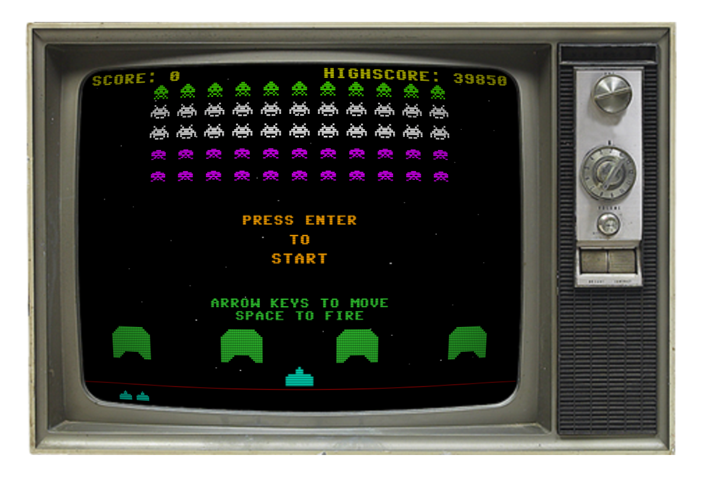

<!-- @format -->

# Space Cowboys

(YES It comes with an old time TV for you to play on 😉)

 

I love those old games from my childhood, so I've begone recreating them in JavaScript.

This is my first attempt at recreating **'Space Invaders'** from Taito, most people probably knows it from the Atari 2600 game consol.

<https://en.wikipedia.org/wiki/Space_Invaders>

---

 
 

# Attributions

## C64 font.
>
> **Devin D. Cook** <http://www.DevinCook.com>
>
>Link to font <https://blogfonts.com/commodore-64-2.font>

 

## CRT scanlines.
>
> **Zachary Johnson** <https://www.zachstronaut.com/>
>
> Link to article <https://www.zachstronaut.com/posts/2012/08/17/webgl-fake-crt-html5.html>

 

## glfx.js image effects WebGL library.
>
> **Evan Wallace**
>
> Link to GitHub repo <https://github.com/evanw/glfx.js>
